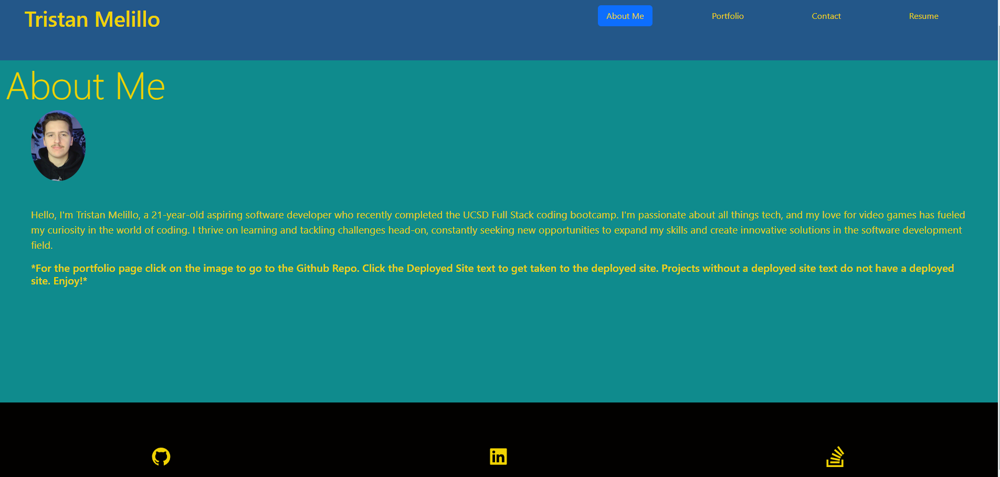

# Portfolio V2

### [Description](#description) | [Features](#features) | [Images](#images) | [Links](#links) | [Setup](#setup) | [Usage](#usage) | [Credit](#credit) | [Contact](#contact)

## Description
This is my new and improved reactive Portfolio Website

## Features

- Nav Bar with selective tabs
- Hoverable buttons
- A place with all my projects for viewing

## Images 

## Links
Link to deployed site

Github Repo 
https://github.com/TristanM225/Portfolio.V2 
 
## Setup

Locally you will need to:

- Npm i 
- npm run build
- npm run dev

Enjoy!

## Usage
A way to show off my projects and what I have learned from the UCSD Coding Bootcamp!

## Project Status
Project is: _In-Progress_

## Credit 
UCSD Email verification

20-React\01-Activities\16-Stu_React-Forms

PDF preview

https://marketplace.visualstudio.com/items?itemName=analytic-signal.preview-pdf#:~:text=To%20preview%20a%20PDF%20file%20in%20a%20new%20editor%20(if,choose%20Open%20to%20the%20Side 

color palet 

https://coolors.co/121619-4e6e58-4c8577-53ff45-f0f2ef

## Contact
Created by TristanM225 Reach out to me by email! TristanM225@gmail.com
